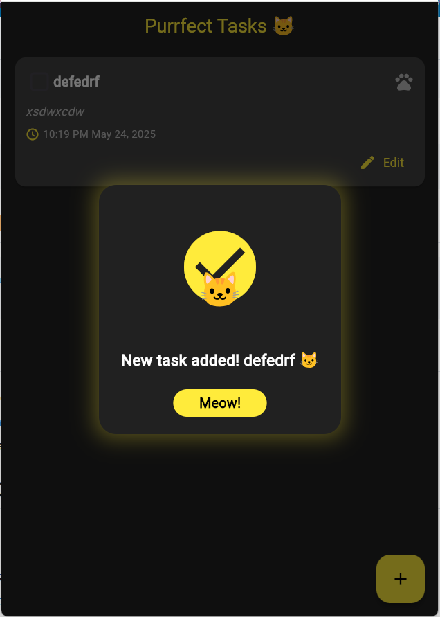

# 🐱 Purrfect Tasks 🐱

A delightful and purr-fectly organized task management app with a cute cat theme! ✨

## 🌟 Features

- 🎯 Create, edit, and delete tasks with ease
- 📅 Set dates and times with beautiful pickers
- ✅ Mark tasks as complete with satisfying animations
- 🎨 Beautiful dark theme with yellow accents
- 🐾 Cat-themed success messages and animations
- 📱 Responsive and user-friendly interface

## 🎮 Getting Started

### Prerequisites

- Flutter SDK (version 3.2.6 or higher)
- Dart SDK (version 3.0.0 or higher)

### Installation

1. Clone the repository:
```bash
git clone https://github.com/liz3158/purrfect_to_do_list.git
```

2. Navigate to the project directory:
```bash
cd purrfect_to_do_list
```

3. Install dependencies:
```bash
flutter pub get
```

4. Run the app:
```bash
flutter run
```

## 🎨 App Screenshots

### Home Screen


### Add Task


## 🛠️ Built With

- [Flutter](https://flutter.dev/) - The UI framework
- [Provider](https://pub.dev/packages/provider) - State management
- [Intl](https://pub.dev/packages/intl) - Internationalization and formatting

## 🐱 Features in Detail

### Task Management
- ✏️ Create new tasks with title and description
- 📝 Edit existing tasks
- 🗑️ Delete tasks with a swipe
- ✅ Mark tasks as complete with a satisfying animation

### Date and Time
- 📅 Beautiful date picker
- ⏰ Easy time selection
- 📊 Organized task timeline

### User Interface
- 🌙 Dark theme for comfortable viewing
- 💛 Yellow accents for a cheerful look
- 🎭 Smooth animations and transitions
- 🐱 Cat-themed success messages

## 🤝 Contributing

Feel free to contribute to this project! Here's how:

1. Fork the repository
2. Create your feature branch (`git checkout -b feature/AmazingFeature`)
3. Commit your changes (`git commit -m 'Add some AmazingFeature'`)
4. Push to the branch (`git push origin feature/AmazingFeature`)
5. Open a Pull Request

## 📝 License

This project is licensed under the MIT License - see the [LICENSE](LICENSE) file for details.

## 🙏 Acknowledgments

- Thanks to all the Flutter developers for their amazing framework
- Special thanks to all the cats that inspired this project 😺

---
Made with 💛 and 🐱 by liz3158
